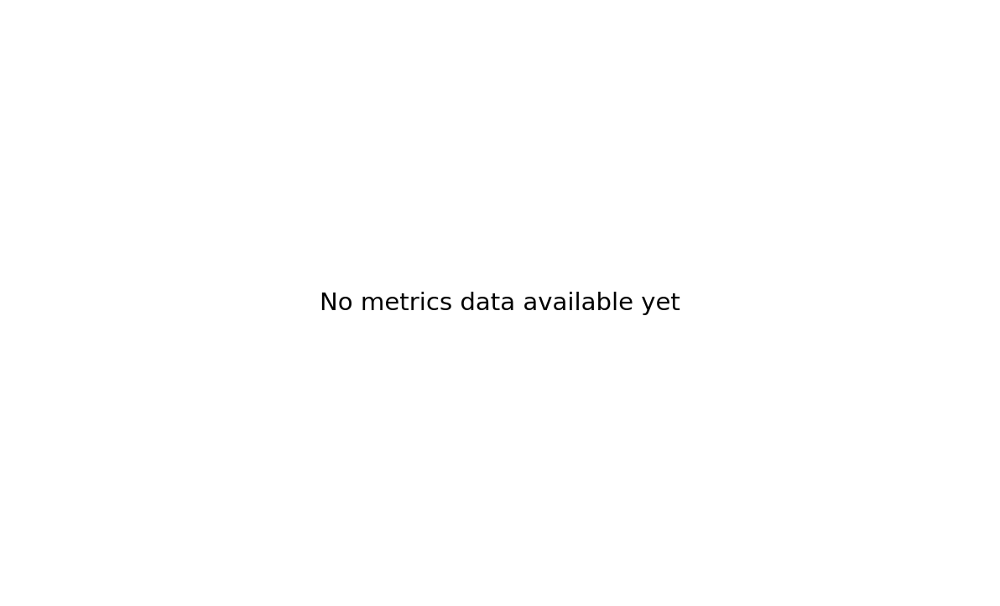
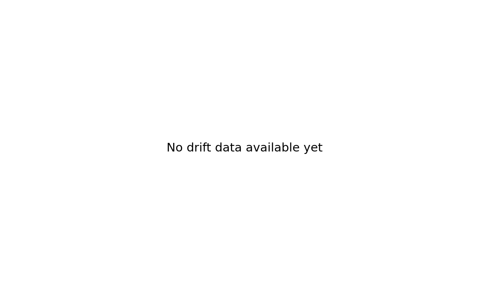

# Phishing Detection Model Performance

## Overview

This project develops a machine learning model for detecting phishing URLs using URLScan.io API data.

## Model Performance Over Time

### Performance Metrics

Track how the model's performance evolves over time to identify improvements or degradation.

### Confusion Matrix

Latest model confusion matrix showing prediction accuracy across classes.

### Feature Drift Detection

Monitor feature drift to detect changes in data distribution that may affect model performance.

## Dataset Information

- **Source**: URLScan.io API + Phishing URL datasets
- **Training samples**: TBD
- **Test samples**: TBD
- **Features**: TBD

## Model Architecture

Details about the model architecture, feature engineering, and training process will be documented here.

## Latest Updates

Check back for updates on model performance and improvements.

---

_Last updated: {{ site.time | date: "%Y-%m-%d" }}_
